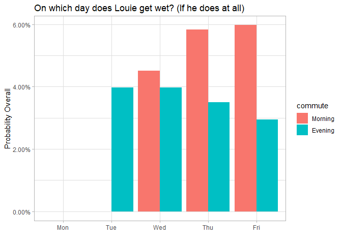

2018-12-07 Rain Simulation
================
zpb
December 15, 2018

The Riddle
==========

Louie walks to and from work every day. In his city, there is a 50 percent chance of rain each morning and an independent 40 percent chance each evening. His habit is to bring (and use) an umbrella if it’s raining when he leaves the house or office, but to leave them all behind if not. Louie owns three umbrellas.

On Sunday night, two are with him at home and one is at his office. Assuming it never starts raining during his walk to his home or office, what is the probability that he makes it through the work week without getting wet?

<https://53eig.ht/2UoA8iS>

<https://youtu.be/TDzd73z8thU>

``` r
set.seed(42069420)
library(tidyverse)
```

    ## -- Attaching packages ----------------------------------------------------------------------------- tidyverse 1.2.1 --

    ## v ggplot2 3.1.0     v purrr   0.2.5
    ## v tibble  1.4.2     v dplyr   0.7.8
    ## v tidyr   0.8.2     v stringr 1.3.1
    ## v readr   1.3.0     v forcats 0.3.0

    ## -- Conflicts -------------------------------------------------------------------------------- tidyverse_conflicts() --
    ## x dplyr::filter() masks stats::filter()
    ## x dplyr::lag()    masks stats::lag()

``` r
library(scales)
```

    ## 
    ## Attaching package: 'scales'

    ## The following object is masked from 'package:purrr':
    ## 
    ##     discard

    ## The following object is masked from 'package:readr':
    ## 
    ##     col_factor

``` r
theme_set(theme_light())
```

First try
=========

crossing() is similar to expand.grid() in that it makes all combinations of what you ask

don't know how to make it call on the previous umb\_\*\_start to start the later columns

``` r
crossing(trial = 1:3,
         dotw = 1:5) %>%
  mutate(rain_morn = sample(0:1, size = n(), replace = TRUE, prob = c(0.5, 0.5)),
         rain_eve = sample(0:1, size = n(), replace = TRUE, prob = c(0.6, 0.4)),
         umb_home_start = ifelse(dotw == 1, 2, NA),
         umb_work_start = ifelse(dotw == 1, 1, NA),
         umb_work_end = ifelse(rain_morn == 1 & rain_eve == 1, umb_work_start,
                               ifelse(rain_morn == 1 & rain_eve == 0, umb_work_start+1,
                                      ifelse(rain_morn == 0 & rain_eve == 1, umb_work_start-1,
                                             ifelse(rain_morn == 0 & rain_eve == 0, umb_work_start,
                                                    NA)))),
         umb_home_end = ifelse(rain_morn == 1 & rain_eve == 1, umb_home_start,
                               ifelse(rain_morn == 1 & rain_eve == 0, umb_home_start-1,
                                      ifelse(rain_morn == 0 & rain_eve == 1, umb_home_start+1,
                                             ifelse(rain_morn == 0 & rain_eve == 0, umb_work_start,
                                                    NA)))))
```

    ## # A tibble: 15 x 8
    ##    trial  dotw rain_morn rain_eve umb_home_start umb_work_start
    ##    <int> <int>     <int>    <int>          <dbl>          <dbl>
    ##  1     1     1         1        0              2              1
    ##  2     1     2         0        1             NA             NA
    ##  3     1     3         0        1             NA             NA
    ##  4     1     4         0        1             NA             NA
    ##  5     1     5         1        1             NA             NA
    ##  6     2     1         1        1              2              1
    ##  7     2     2         0        0             NA             NA
    ##  8     2     3         1        1             NA             NA
    ##  9     2     4         0        0             NA             NA
    ## 10     2     5         0        0             NA             NA
    ## 11     3     1         0        1              2              1
    ## 12     3     2         1        1             NA             NA
    ## 13     3     3         1        0             NA             NA
    ## 14     3     4         1        1             NA             NA
    ## 15     3     5         0        0             NA             NA
    ## # ... with 2 more variables: umb_work_end <dbl>, umb_home_end <dbl>

I realized that I ran into an issue where I couldn't break down the umbrella change by each commute this way. I need to add a column that is the commute so I can cumsum() to add changes.

Building table with commutes
============================

Arrage is used to make sure it goes in order of each trial, dotw, then Morning and Evening

rain = chance of rain for a given morning or evening. 50% morning, 40% evening

``` r
crossing(trial = 1:5,
         dotw = 1:5,
         commute = c("Morning", "Evening")) %>%
  arrange(trial, dotw, factor(commute, levels = c("Morning", "Evening"))) %>%
  mutate(rain = ifelse(commute == "Morning", sample(0:1, size = n(), replace = TRUE, prob = c(0.5, 0.5)),
                       sample(0:1, size = n(), replace = TRUE, prob = c(0.6, 0.4))))
```

    ## # A tibble: 50 x 4
    ##    trial  dotw commute  rain
    ##    <int> <int> <chr>   <int>
    ##  1     1     1 Morning     1
    ##  2     1     1 Evening     1
    ##  3     1     2 Morning     1
    ##  4     1     2 Evening     1
    ##  5     1     3 Morning     1
    ##  6     1     3 Evening     1
    ##  7     1     4 Morning     0
    ##  8     1     4 Evening     0
    ##  9     1     5 Morning     1
    ## 10     1     5 Evening     1
    ## # ... with 40 more rows

Calculating change in umbrellas by commute
==========================================

home\_delta calculates the change in umbrellas at home for each combination of commute and rain

office\_delta calculates the change in umbrellas at the office for each combination of commute and rain

I really wanted to make office\_delta = -home\_delta but for some reason that wouldn't work!

``` r
crossing(trial = 1:5,
         dotw = 1:5,
         commute = c("Morning", "Evening")) %>%
  arrange(trial, dotw, factor(commute, levels = c("Morning", "Evening"))) %>%
  mutate(rain = ifelse(commute == "Morning", sample(0:1, size = n(), replace = TRUE, prob = c(0.5, 0.5)),
                       sample(0:1, size = n(), replace = TRUE, prob = c(0.6, 0.4))),
         home_delta = ifelse(commute == "Morning" & rain == 1, -1,
                             ifelse(commute == "Morning" & rain == 0, 0,
                                    ifelse(commute == "Evening" & rain == 1, +1,
                                           ifelse(commute == "Evening" & rain == 0, 0, "ERROR")))),
         office_delta = ifelse(commute == "Morning" & rain == 1, +1,
                             ifelse(commute == "Morning" & rain == 0, 0,
                                    ifelse(commute == "Evening" & rain == 1, -1,
                                           ifelse(commute == "Evening" & rain == 0, 0, "ERROR"))))
         )
```

    ## # A tibble: 50 x 6
    ##    trial  dotw commute  rain home_delta office_delta
    ##    <int> <int> <chr>   <int> <chr>      <chr>       
    ##  1     1     1 Morning     0 0          0           
    ##  2     1     1 Evening     0 0          0           
    ##  3     1     2 Morning     0 0          0           
    ##  4     1     2 Evening     1 1          -1          
    ##  5     1     3 Morning     0 0          0           
    ##  6     1     3 Evening     0 0          0           
    ##  7     1     4 Morning     1 -1         1           
    ##  8     1     4 Evening     0 0          0           
    ##  9     1     5 Morning     0 0          0           
    ## 10     1     5 Evening     1 1          -1          
    ## # ... with 40 more rows

Counting umbrellas at a given commute
=====================================

Then we group\_by(trial) to then add a new column that adds up the number of umbrellas at each location using cumsum(). Home starts with 2 umbrellas and the office starts with 1.

``` r
crossing(trial = 1:5,
         dotw = 1:5,
         commute = c("Morning", "Evening")) %>%
  arrange(trial, dotw, factor(commute, levels = c("Morning", "Evening"))) %>%
  mutate(rain = ifelse(commute == "Morning", sample(0:1, size = n(), replace = TRUE, prob = c(0.5, 0.5)),
                       sample(0:1, size = n(), replace = TRUE, prob = c(0.6, 0.4))),
         home_delta = ifelse(commute == "Morning" & rain == 1, -1,
                             ifelse(commute == "Morning" & rain == 0, 0,
                                    ifelse(commute == "Evening" & rain == 1, +1,
                                           ifelse(commute == "Evening" & rain == 0, 0, "ERROR")))),
         office_delta = ifelse(commute == "Morning" & rain == 1, +1,
                             ifelse(commute == "Morning" & rain == 0, 0,
                                    ifelse(commute == "Evening" & rain == 1, -1,
                                           ifelse(commute == "Evening" & rain == 0, 0, "ERROR"))))
         ) %>%
  group_by(trial) %>%
  mutate(umb_home = 2 + cumsum(home_delta),
         umb_office = 1 + cumsum(office_delta))
```

    ## # A tibble: 50 x 8
    ## # Groups:   trial [5]
    ##    trial  dotw commute  rain home_delta office_delta umb_home umb_office
    ##    <int> <int> <chr>   <int> <chr>      <chr>           <dbl>      <dbl>
    ##  1     1     1 Morning     1 -1         1                   1          2
    ##  2     1     1 Evening     0 0          0                   1          2
    ##  3     1     2 Morning     0 0          0                   1          2
    ##  4     1     2 Evening     1 1          -1                  2          1
    ##  5     1     3 Morning     0 0          0                   2          1
    ##  6     1     3 Evening     1 1          -1                  3          0
    ##  7     1     4 Morning     0 0          0                   3          0
    ##  8     1     4 Evening     0 0          0                   3          0
    ##  9     1     5 Morning     1 -1         1                   2          1
    ## 10     1     5 Evening     0 0          0                   2          1
    ## # ... with 40 more rows

Determining successes
=====================

We then summarize() each group by checking to see if the number of umbrellas at home or the office ever are less than 0. i.e. if Louie ever needed an umbrella, but did not have one available to him.

``` r
crossing(trial = 1:5,
         dotw = 1:5,
         commute = c("Morning", "Evening")) %>%
  arrange(trial, dotw, factor(commute, levels = c("Morning", "Evening"))) %>%
  mutate(rain = ifelse(commute == "Morning", sample(0:1, size = n(), replace = TRUE, prob = c(0.5, 0.5)),
                       sample(0:1, size = n(), replace = TRUE, prob = c(0.6, 0.4))),
         home_delta = ifelse(commute == "Morning" & rain == 1, -1,
                             ifelse(commute == "Morning" & rain == 0, 0,
                                    ifelse(commute == "Evening" & rain == 1, +1,
                                           ifelse(commute == "Evening" & rain == 0, 0, "ERROR")))),
         office_delta = ifelse(commute == "Morning" & rain == 1, +1,
                             ifelse(commute == "Morning" & rain == 0, 0,
                                    ifelse(commute == "Evening" & rain == 1, -1,
                                           ifelse(commute == "Evening" & rain == 0, 0, "ERROR"))))
         ) %>%
  group_by(trial) %>%
  mutate(umb_home = 2 + cumsum(home_delta),
         umb_office = 1 + cumsum(office_delta)) %>%
  summarize(success = !any(umb_home < 0 | umb_office < 0 ))
```

    ## # A tibble: 5 x 2
    ##   trial success
    ##   <int> <lgl>  
    ## 1     1 TRUE   
    ## 2     2 TRUE   
    ## 3     3 TRUE   
    ## 4     4 FALSE  
    ## 5     5 TRUE

Counting successes
==================

We can then take the mean of success column of that last table to see the % chance of success

``` r
simulations <- crossing(trial = 1:1e6,
         dotw = 1:5,
         commute = c("Morning", "Evening")) %>%
  arrange(trial, dotw, factor(commute, levels = c("Morning", "Evening"))) %>%
  mutate(rain = ifelse(commute == "Morning", sample(0:1, size = n(), replace = TRUE, prob = c(0.5, 0.5)),
                       sample(0:1, size = n(), replace = TRUE, prob = c(0.6, 0.4))),
         home_delta = ifelse(commute == "Morning" & rain == 1, -1,
                             ifelse(commute == "Morning" & rain == 0, 0,
                                    ifelse(commute == "Evening" & rain == 1, +1,
                                           ifelse(commute == "Evening" & rain == 0, 0, "ERROR")))),
         office_delta = ifelse(commute == "Morning" & rain == 1, +1,
                             ifelse(commute == "Morning" & rain == 0, 0,
                                    ifelse(commute == "Evening" & rain == 1, -1,
                                           ifelse(commute == "Evening" & rain == 0, 0, "ERROR"))))
         ) %>%
  group_by(trial) %>%
  mutate(umb_home = 2 + cumsum(home_delta),
         umb_office = 1 + cumsum(office_delta))

simulations %>%
  summarize(success = !any(umb_home < 0 | umb_office < 0 )) %>%
  summarize(pct_successes = mean(success))
```

    ## # A tibble: 1 x 1
    ##   pct_successes
    ##           <dbl>
    ## 1         0.693

Answer
======

Louie's got ~69.3% chance of making it through the week this way!

The day Louie first gets wet
============================

Filters all lines of data for where umb\_home or umb\_office is less than 0

Finds only the first one for each trial using distinct()

counts how many times Louie first gets wet by the day of the week and the commute

Changes the day of the week into a readable format using

days &lt;- c("Mon", "Tue", "Wed", "Thu", "Fri")

mutate(dotw = factor(days\[dotw\], levels = days)) turns dotw from a number to an ordered factor of dotw

dotw needs to be ordered 1,2,3,4,5 to match with Mon,Tue,Wed,Thu,Fri to make this work

Changes the order of morning and evening in the plot using fct\_relevel

complete() adds each dotw & commute combination to the count()

Graphs out all of the days he first gets wet!

``` r
days <- c("Mon", "Tue", "Wed", "Thu", "Fri")

simulations %>%
  ungroup() %>%
  filter(umb_home < 0 | umb_office < 0) %>%
  distinct(trial, .keep_all = TRUE) %>%
  count(dotw, commute, sort = TRUE) %>%
  mutate(dotw = factor(days[dotw], levels = days),
         commute = fct_relevel(commute, c("Morning", "Evening"))) %>%
  complete(dotw, commute) %>%
  ggplot(aes(dotw, n / 1e6, fill = commute)) +
  geom_col(position = "dodge") +
  scale_y_continuous(labels = percent_format()) +
  labs(title = "On which day does Louie get wet? (If he does at all)",
       y = "Probability Overall",
       x = "")
```

    ## Warning: Removed 3 rows containing missing values (geom_col).



David Robinson Technique
------------------------

Adding a row for each commute
=============================

Using rbinom(n(), 1, ifelse(commute == morn, .5, .4)) This is a clever solution that was used in TT

``` r
crossing(trial = 1:3,
         dotw = 1:5,
         commute = c("Morning", "Evening")) %>%
  arrange(trial, dotw, factor(commute, levels = c("Morning", "Evening"))) %>%
  mutate(rain = rbinom(n(), 1, ifelse(commute == "Morning", 0.5, 0.4)))
```

    ## # A tibble: 30 x 4
    ##    trial  dotw commute  rain
    ##    <int> <int> <chr>   <int>
    ##  1     1     1 Morning     0
    ##  2     1     1 Evening     0
    ##  3     1     2 Morning     0
    ##  4     1     2 Evening     0
    ##  5     1     3 Morning     1
    ##  6     1     3 Evening     1
    ##  7     1     4 Morning     1
    ##  8     1     4 Evening     0
    ##  9     1     5 Morning     0
    ## 10     1     5 Evening     0
    ## # ... with 20 more rows

Using case\_when to determine umbrella change
=============================================

case\_when() requires a sequence of 2 sided formulas where the left is the input and the right is the output

You separate the input and output with a tilde (~)

Put the most general case at the end. Here, TRUE ~ 0 indicates that all other cases result in a 0.

For some reason I can set office\_delta = -home\_delta here. Talk about a cleaner way to do it!

``` r
crossing(trial = 1:1e6,
         dotw = 1:5,
         commute = c("Morning", "Evening")) %>%
  arrange(trial, dotw, factor(commute, levels = c("Morning", "Evening"))) %>%
  mutate(rain = rbinom(n(), 1, ifelse(commute == "Morning", 0.5, 0.4)),
         home_delta = case_when(
           commute == "Morning" & rain == 1 ~ -1,
           commute == "Evening" & rain == 1 ~ 1,
           TRUE ~ 0),
         office_delta = -home_delta) %>%
  group_by(trial) %>%
  mutate(umb_home = 2 + cumsum(home_delta),
         umb_office = 1 + cumsum(office_delta)) %>%
  summarize(success = !any(umb_home < 0 | umb_office < 0 )) %>%
  summarize(pct_success = mean(success))
```

    ## # A tibble: 1 x 1
    ##   pct_success
    ##         <dbl>
    ## 1       0.693

``` r
knitr::knit_exit()
```
